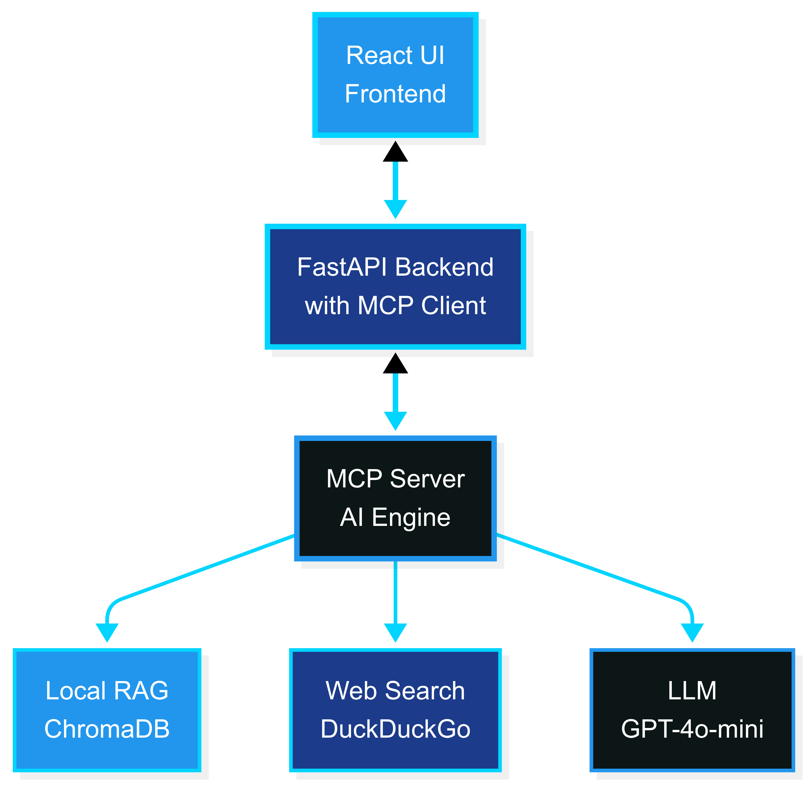

<!-- _class: lead -->
<!-- _paginate: false -->
<!-- _header: "" -->
<!-- _footer: "" -->

# ContainerShip
## AI-Powered Docker Optimization Platform

**Uriel Buitrago & Shane Aung**
Advanced Programming Tools - Summer 2025

---

### The Problem with Current Docker Optimization

• **Static analysis tools** lack contextual understanding
• **Commercial platforms** operate as "black boxes" with vendor lock-in  
• **Generic AI tools** don't understand containerization specifics
• **Developers struggle** with evolving best practices
• **Security vulnerabilities** often go undetected until runtime

<!-- 
Speaker Notes: Let's start by understanding the problem we're solving. Currently, Docker optimization relies heavily on static analysis tools like Hadolint that work with predefined rules. While these catch obvious mistakes, they lack contextual understanding of your specific technology stack. Commercial platforms like Snyk offer more features but operate as black boxes with expensive subscriptions and vendor lock-in. Even modern AI tools like GitHub Copilot, while powerful for general code completion, don't have the specialized containerization knowledge needed for effective Docker optimization. This leaves developers manually researching best practices and security updates, which is time-consuming and error-prone.
-->

---

### ContainerShip Solution Overview

• **AI-powered optimization** with specialized containerization expertise
• **Hybrid knowledge system**: Local docs + Real-time web intelligence
• **Technology-aware analysis** tailored to your specific stack
• **Interactive web interface** with real-time analysis
• **Extensible MCP architecture** for continuous improvement

<!-- 
Speaker Notes: ContainerShip addresses these limitations through an AI-powered approach that combines the best of both worlds. We use specialized containerization expertise through Large Language Models, but unlike generic AI tools, our system has deep Docker knowledge. Our hybrid architecture combines comprehensive local documentation with real-time web intelligence, ensuring recommendations are both foundationally sound and current. The platform provides technology-aware analysis - it understands whether you're working with Python Flask, Node.js React, or Java Spring applications and tailors recommendations accordingly. All of this is delivered through an intuitive web interface that provides real-time analysis and feedback.
-->

---

### System Architecture

<!-- 
Speaker Notes: Let me walk you through our three-tier architecture. The frontend is a React TypeScript single-page application featuring an advanced Dockerfile editor with syntax highlighting and real-time analysis capabilities. The FastAPI backend serves as our orchestration layer and importantly houses our MCP client, which manages all communication with our AI engine. The AI engine is built as an MCP server that coordinates multiple specialized tools for different aspects of Docker optimization. Our knowledge system draws from two sources: ChromaDB provides comprehensive local Docker documentation through a RAG system, while DuckDuckGo integration ensures we have access to current security updates and best practices. All of this intelligence is processed through GPT-4o-mini, which we've optimized for containerization analysis through sophisticated prompt engineering.
-->

---

### Architecture Components

#### **Frontend**: React TypeScript SPA
• Real-time Dockerfile editor with syntax highlighting
• Interactive analysis visualization

#### **Backend**: FastAPI Server  
• Integrated MCP client for AI communication
• Technology detection and processing pipeline

#### **AI Engine**: MCP Server
• Specialized Docker optimization tools
• Hybrid knowledge system coordination

#### **Knowledge Sources**
• **ChromaDB**: Local Docker documentation (RAG)
• **DuckDuckGo**: Real-time web intelligence

---

### Model Context Protocol (MCP) Integration

#### **docker_docs**
RAG system with comprehensive Docker documentation

#### **web_search_docker** 
Real-time intelligence gathering

#### **optimize_dockerfile**
Multi-layered analysis engine

#### **check_security_best_practices**
Current vulnerability assessment  

#### **search_dockerfile_examples**
Community-validated patterns

<!-- 
Speaker Notes: The heart of our innovation lies in our Model Context Protocol integration. We've developed five specialized MCP tools that work together seamlessly. The docker_docs tool serves as our knowledge foundation, implementing a sophisticated RAG system built on extensive Docker documentation with ChromaDB and OpenAI embeddings. Our web_search_docker tool complements this with real-time intelligence, performing optimized searches for current security vulnerabilities and emerging best practices. The optimize_dockerfile tool orchestrates comprehensive analysis combining local knowledge with current web research. We also have specialized tools for security assessment and finding community-validated containerization patterns. This modular approach means we can easily add new capabilities without disrupting existing functionality.
-->

---

### User Experience & Workflow

#### **Upload**
Drag-and-drop interface with instant validation

#### **Analysis** 
Automatic technology stack detection

#### **Processing**
Concurrent analysis across multiple dimensions

#### **Results**
Side-by-side comparison with color-coded recommendations

#### **Interactive**
Navigable recommendation cards with detailed explanations

<!-- 
Speaker Notes: The user experience is designed to be both intuitive and comprehensive. Users start with a simple drag-and-drop interface that provides instant feedback and validation. Once uploaded, our system automatically detects the underlying technology stack - whether it's Python Flask, Node.js, Java Spring, or any other framework. The analysis process runs concurrently across multiple dimensions: security vulnerabilities, performance optimization, and best practices adherence. Results are presented in an interactive side-by-side comparison showing the original Dockerfile alongside our optimized version. Color-coded highlighting draws attention to problematic areas, while navigable recommendation cards provide detailed explanations for each suggestion. This approach transforms complex technical analysis into actionable, understandable guidance.
-->

---

### AI Capabilities & Prompt Engineering

#### **Context Management**
Seamless integration of local + web intelligence

#### **Technology Awareness**
Framework-specific optimization strategies

#### **Security Intelligence**
Current threat landscape integration

#### **Prompt Templates**
Carefully crafted for containerization expertise

#### **Progressive Enhancement**
Continuous quality improvement through multiple sources

<!-- 
Speaker Notes: Our AI capabilities go far beyond simple code generation. We've implemented sophisticated context management that seamlessly blends local documentation with current web intelligence. The system is technology-aware, meaning it understands the specific requirements and constraints of different frameworks - a Python Flask app gets different optimization strategies than a Node.js React application. Our security intelligence integration ensures recommendations consider current threat landscapes, not just static best practices. This is achieved through carefully crafted prompt templates optimized specifically for containerization expertise. We implement progressive enhancement where analysis quality continuously improves by gathering additional context from multiple sources, ensuring comprehensive coverage of optimization opportunities.
-->

---

### Live Product Demo

#### **Sample Dockerfile**
Suboptimal Python Flask application

#### **Real-time Analysis** 
Technology detection and processing

#### **Optimization Results**
Security, performance, and best practices

#### **Before/After Comparison**
Visual improvement demonstration

#### **Interactive Features**
Recommendation exploration

<!-- 
Speaker Notes: Let me show you ContainerShip in action. [If doing live demo: demonstrate the actual interface. If not live:] Here's a walkthrough of analyzing a typical suboptimal Python Flask Dockerfile. Notice how the system immediately detects this as a Python Flask application and begins tailored analysis. Within seconds, we see comprehensive results covering security vulnerabilities - like running as root user, performance issues - such as inefficient layer ordering, and best practices violations - like missing health checks. The before-and-after comparison clearly shows the improvements: multi-stage builds reducing image size, proper user management for security, and optimized layer caching for faster builds. Users can click through each recommendation card to understand not just what to change, but why these changes improve their container's security, performance, and maintainability.
-->

---

### Technical Innovation & Advantages

#### **Hybrid Intelligence**
First platform combining local docs + real-time web search

#### **Extensible Architecture**
Easy addition of new analysis tools

#### **Specialized Expertise**
Purpose-built for containerization vs. generic AI

#### **Open Foundation**
Transparent, community-driven development

#### **Cost-Effective**
GPT-4o-mini optimization for efficiency

<!-- 
Speaker Notes: What sets ContainerShip apart is our unique combination of technical innovations. We're the first platform to successfully combine comprehensive local documentation with real-time web intelligence in a containerization context. Our extensible MCP-based architecture means new analysis capabilities can be added seamlessly as containerization practices evolve. Unlike generic AI tools, we've built specialized expertise specifically for Docker optimization. Our open foundation approach ensures transparency and community-driven development, avoiding vendor lock-in issues. We've also optimized for cost-effectiveness using GPT-4o-mini while maintaining high-quality analysis through sophisticated prompt engineering.
-->

---

### Impact & Results

#### **Developer Productivity**
Reduces research time for Docker best practices

#### **Security Enhancement**
Proactive vulnerability identification

#### **Cost Optimization**
Systematic image size and performance improvements

#### **Knowledge Democratization**
Makes expert containerization accessible

#### **Future-Proof**
Continuous learning from evolving ecosystem

<!-- 
Speaker Notes: The impact of ContainerShip extends across multiple dimensions of software development. Developer productivity increases significantly by reducing time spent researching Docker best practices - our automated analysis delivers expert-level recommendations instantly. Security posture improves through proactive vulnerability identification with current threat intelligence, catching issues before they reach production. Cost optimization emerges through systematic image size reduction and performance improvements that translate directly to reduced infrastructure costs. Perhaps most importantly, we democratize containerization expertise, making sophisticated optimization knowledge accessible to developers regardless of their Docker experience level. The platform's continuous learning capability ensures recommendations remain current as the containerization ecosystem evolves.
-->

---

### Future Enhancements & Roadmap

#### **Multi-LLM Support**
Integration with Claude, Llama, and emerging models

#### **CI/CD Integration** 
Automated optimization in development pipelines

#### **Kubernetes Integration**
Extended orchestration platform support

#### **Team Collaboration**
Shared optimization templates and analytics

#### **Enhanced Search**
Premium intelligence sources for enterprise features

<!-- 
Speaker Notes: Looking ahead, our roadmap includes exciting enhancements that will further strengthen ContainerShip's position as the leading containerization optimization platform. We're planning multi-LLM support to integrate with Claude, Llama, and other emerging models, ensuring we always leverage the best AI capabilities available. CI/CD integration will enable automated optimization directly in development pipelines. Kubernetes integration will extend our optimization capabilities to orchestration platforms. Team collaboration features will support shared optimization templates and analytics for enterprise environments. Enhanced search capabilities with premium intelligence sources will provide even more comprehensive analysis for enterprise customers.
-->

---

<!-- _class: lead -->

### Conclusion

#### **Revolutionary Approach**
AI-powered containerization optimization

#### **Proven Architecture** 
Scalable, extensible, and maintainable

#### **Real Impact**
Measurable improvements in security, performance, and productivity

#### **Open Innovation**
Community-driven development for long-term success

---

<!-- _class: lead -->

# Questions & Discussion

Thank you for your attention!

<!-- 
Speaker Notes: In conclusion, ContainerShip represents a revolutionary approach to containerization optimization that successfully bridges traditional documentation-based learning with intelligent, real-time assistance. Our proven architecture demonstrates that specialized AI applications can deliver significant value beyond generic code completion tools. We've shown real impact across security, performance, and developer productivity metrics. Most importantly, our open innovation approach ensures this technology will continue evolving with community input and emerging best practices. I'd be happy to take any questions about ContainerShip's architecture, implementation, or future direction. Thank you for your attention.
-->
