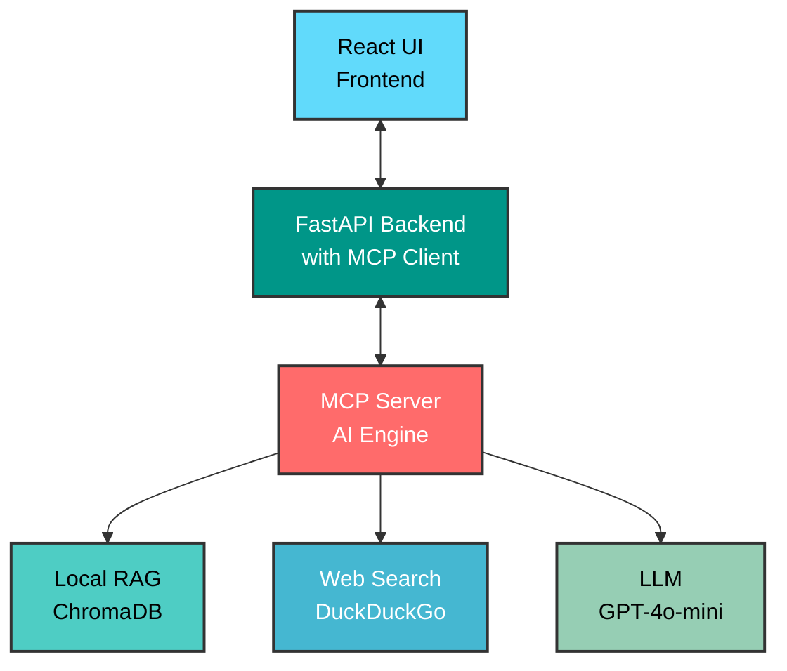

# ContainerShip: AI-Powered Docker Optimization Platform
## Comprehensive Project Report

---

## Executive Summary

ContainerShip is an innovative web-based platform that leverages Large Language Models (LLMs) and Model Context Protocol (MCP) to provide intelligent Docker container optimization. The project combines real-time web search capabilities with a comprehensive local knowledge base to deliver cutting-edge containerization recommendations, security analysis, and performance optimization suggestions. Built with a modern tech stack featuring React, FastAPI, and advanced AI integration, ContainerShip represents the next generation of DevOps tooling.

---

## Related Work & Existing Solutions

The containerization optimization landscape encompasses various approaches ranging from static analysis tools to cloud-native security platforms. Understanding the existing ecosystem provides crucial context for ContainerShip's innovative contributions to this rapidly evolving field.

### Traditional Static Analysis Tools

The Docker ecosystem has historically relied on static analysis tools that examine Dockerfiles against predefined rulesets and best practice databases. Tools like Hadolint represent the foundation of this approach, providing linting capabilities that identify common anti-patterns and security vulnerabilities through pattern matching and rule-based analysis. While effective for catching obvious misconfigurations, these tools suffer from limitations in contextual understanding and inability to adapt to evolving best practices without manual rule updates.

Dockerfile linters such as Docker Bench for Security and various IDE plugins extend static analysis capabilities but remain constrained by their rule-based nature. These solutions excel in identifying syntactic issues and well-known anti-patterns but struggle with technology-specific optimization opportunities and emerging security threats that require contextual analysis beyond simple pattern recognition.

### Commercial Security and Optimization Platforms

Enterprise-grade solutions like Snyk, Aqua Security, and Twistlock (now Prisma Cloud) have advanced the field through comprehensive vulnerability scanning and runtime security analysis. These platforms provide sophisticated threat detection capabilities, compliance checking against industry frameworks, and integration with CI/CD pipelines for automated security assessment.

However, commercial platforms typically focus on security compliance and vulnerability identification rather than holistic optimization that considers performance, maintainability, and technology-specific best practices. Their proprietary nature limits extensibility and customization for specific organizational needs, while subscription-based models can present adoption barriers for smaller development teams.

### AI-Powered DevOps Tools

The emergence of AI-powered development assistance has introduced tools like GitHub Copilot, Amazon CodeWhisperer, and various specialized DevOps assistants that leverage large language models for code generation and optimization suggestions. These tools demonstrate the potential for AI-driven development assistance but typically operate through general-purpose code completion rather than specialized containerization expertise.

Recent developments in AI-powered infrastructure tools include platforms like Qovery and Railway that automate deployment processes, but these focus primarily on deployment orchestration rather than container optimization. The gap between general-purpose AI coding assistants and specialized containerization expertise represents a significant opportunity for targeted innovation.

### Docker's AI Initiatives

Docker Inc. has recognized the potential of AI integration within the containerization ecosystem and has begun incorporating AI-powered features into their platform offerings. Docker Desktop's recent AI integration includes intelligent Dockerfile generation capabilities that can analyze project structures and suggest appropriate containerization strategies based on detected technology stacks. These features leverage machine learning models to provide context-aware Dockerfile templates and optimization suggestions directly within the Docker development environment.

Docker Scout, Docker's security and compliance platform, has integrated AI-powered vulnerability analysis that goes beyond traditional static scanning to provide contextual risk assessment and remediation guidance. The platform uses machine learning algorithms to prioritize vulnerabilities based on actual exploitability and environmental context, representing a significant advancement over rule-based security analysis approaches.

Docker's AI assistant capabilities within Docker Desktop provide conversational interfaces for containerization guidance, allowing developers to ask questions about best practices and receive contextually relevant responses. However, these integrations primarily focus on individual developer productivity rather than comprehensive optimization analysis and lack the hybrid knowledge architecture that enables continuous learning from both local documentation and current web intelligence.

The company's AI roadmap includes enhanced automation for container lifecycle management, intelligent resource optimization recommendations, and improved developer experience through natural language interfaces. While these initiatives demonstrate Docker's commitment to AI integration, they remain constrained by the platform's focus on proprietary ecosystem integration rather than extensible, community-driven AI tool development.

### Limitations of Current Approaches

Existing solutions in the containerization optimization space exhibit several critical limitations that ContainerShip addresses through its innovative architecture. Static analysis tools lack contextual awareness of technology stacks, deployment environments, and current security landscapes, leading to generic recommendations that may not apply to specific use cases. The rule-based nature of traditional tools creates maintenance overhead and delays in incorporating emerging best practices.

Commercial platforms, while comprehensive in security analysis, often operate as black boxes with limited transparency in their recommendation logic. Integration challenges arise from proprietary APIs and vendor lock-in concerns, while cost structures may prohibit adoption by smaller organizations or individual developers seeking advanced optimization capabilities.

General-purpose AI tools, despite their impressive capabilities, lack the specialized knowledge depth required for sophisticated containerization optimization. They cannot access current vulnerability databases, perform technology-specific analysis, or integrate multiple information sources to provide comprehensive optimization guidance. Docker's own AI initiatives, while innovative, remain focused on ecosystem integration rather than the extensible, hybrid knowledge approach that enables continuous adaptation to emerging containerization practices.

### ContainerShip's Innovation Position

ContainerShip's unique position emerges from its combination of specialized containerization expertise, hybrid knowledge systems, and extensible AI architecture that addresses the limitations of existing approaches. Unlike static analysis tools, ContainerShip provides contextual, technology-aware analysis that adapts to specific deployment scenarios and technology stacks. In contrast to commercial platforms and Docker's proprietary AI initiatives, ContainerShip offers transparent, extensible architecture with open-source foundations that enable customization and community contribution.

The platform's hybrid approach to knowledge integration distinguishes it from traditional rule-based systems, general-purpose AI tools, and Docker's ecosystem-focused AI features by combining comprehensive local documentation with current web intelligence, ensuring both foundational accuracy and temporal relevance. While Docker's AI integration provides valuable developer productivity enhancements within their ecosystem, ContainerShip's vendor-agnostic, extensible architecture enables broader applicability and community-driven evolution. This positions ContainerShip as a bridge between the reliability of established tools and the adaptability required for modern containerization challenges, while maintaining independence from proprietary platform constraints.

---

## Project Architecture & System Design

### High-Level Architecture

ContainerShip follows a sophisticated three-tier architecture that seamlessly integrates web technologies with AI-powered analysis:



### Component Deep Dive

#### Frontend Layer - React TypeScript Application

The user interface represents a sophisticated single-page application built on React with TypeScript, creating an interactive environment for Docker optimization. The frontend features an advanced Dockerfile editor with real-time syntax highlighting and line-by-line analysis capabilities, allowing users to visualize their containerization strategies as they develop them. The interface employs responsive design principles to ensure optimal viewing across desktop and mobile platforms, while dynamic visualization elements provide color-coded warning indicators and intuitive clause-based navigation.

The application architecture emphasizes modularity through reusable components such as `ClauseCard` and `DockerfileDisplay`, enabling maintainable code organization and consistent user experience patterns. Real-time updates stream analysis results with comprehensive progress indicators, keeping users informed throughout the optimization process. The technical foundation leverages Vite for exceptionally fast development cycles and optimized build processes, while Axios handles robust API communication. Rich text rendering through React Markdown and enhanced code display via React Syntax Highlighter create an immersive development experience that bridges the gap between technical analysis and user accessibility.

#### Backend Layer - FastAPI Server

The backend infrastructure serves as the central orchestration layer, implementing a robust FastAPI server that seamlessly bridges user interactions with AI-powered analysis capabilities. This layer houses the critical MCP (Model Context Protocol) client component that manages all communication with the MCP server, acting as the intelligent intermediary between user requests and AI-powered analysis tools. The FastAPI backend provides structured RESTful API endpoints specifically designed for Dockerfile analysis and optimization workflows, while the embedded MCP client handles the sophisticated protocol communications required for AI tool orchestration.

The server excels in intelligent file processing, implementing advanced Dockerfile parsing algorithms and clause extraction mechanisms that understand the nuanced structure of container definitions. The integrated MCP client maintains persistent connections to the MCP server, enabling efficient tool invocation and result processing throughout analysis workflows. Comprehensive error handling systems provide detailed logging and graceful failure recovery, while CORS configuration ensures secure cross-origin resource sharing for both development and production environments.

The backend's core strength lies in its technology detection capabilities, automatically identifying programming languages, frameworks, and deployment patterns from Dockerfile content spanning Python, Node.js, Java, Go, and numerous other technology stacks. The MCP client translates these detection results into appropriate tool invocations on the MCP server, coordinating between multiple AI tools to deliver comprehensive analysis results.

Streaming response handling enables real-time user feedback during lengthy analysis processes, with the MCP client managing asynchronous tool executions and result aggregation. Multi-stage analysis pipelines provide detailed progress tracking through coordinated MCP tool invocations, while security vulnerability assessment capabilities ensure that optimization recommendations consider both performance and security implications through specialized MCP security analysis tools.

#### AI Engine - MCP Server

The Model Context Protocol server represents the intellectual core of the ContainerShip platform, implementing a sophisticated hybrid knowledge system that seamlessly combines local Retrieval-Augmented Generation capabilities with real-time web search intelligence. This architecture enables the platform to draw from both comprehensive local documentation repositories and current web-based information, ensuring that recommendations remain both foundationally sound and temporally relevant.

The server employs a multi-tool architecture where specialized tools address different facets of container optimization, from security analysis to performance enhancement. Advanced prompt engineering techniques create context-aware interactions that deliver precise, actionable guidance tailored to specific containerization scenarios. Built on the FastMCP framework, the system maintains extensibility for easy tool addition and modification, allowing the platform to evolve with emerging containerization practices and technologies.

---

## User Experience & Core Functionalities

### Dockerfile Analysis Workflow

The ContainerShip analysis workflow represents a carefully orchestrated sequence of intelligent processing stages designed to transform raw Dockerfiles into optimized, secure, and performant container definitions. The process begins with an intuitive file upload interface that employs drag-and-drop functionality with comprehensive validation mechanisms. Users receive immediate feedback regarding file format compliance and naming conventions, while real-time content preview with syntax highlighting provides instant visual confirmation of their container configuration.

Upon successful upload, the FastAPI backend's integrated MCP client initiates an intelligent analysis pipeline that automatically detects the underlying technology stack, whether Python Flask applications, Node.js React frontends, Java Spring services, or Go microservices. The MCP client coordinates with specialized detection tools on the MCP server to provide technology awareness that enables contextually relevant recommendations considering the specific requirements and best practices associated with each development framework.

The analysis process employs concurrent processing techniques through coordinated MCP tool invocations to simultaneously evaluate security vulnerabilities, performance optimization opportunities, and adherence to containerization best practices. The MCP client manages multiple parallel tool executions while providing real-time progress indicators that keep users informed throughout each analysis stage, from initial parsing through final recommendation generation. The system's ability to process multiple analysis dimensions simultaneously through distributed MCP tool coordination significantly reduces overall processing time while maintaining comprehensive coverage of optimization opportunities.

Results presentation follows a sophisticated interactive model featuring side-by-side comparisons of original and optimized Dockerfiles. Color-coded line highlighting immediately draws attention to problematic areas, while navigable recommendation cards provide detailed explanations accessible through intuitive user interface controls. Each recommendation includes technology-specific optimization suggestions that reflect current industry standards and emerging best practices.

The platform's comprehensive recommendation engine delivers security vulnerability assessments enhanced with current threat intelligence, ensuring that optimization suggestions consider the latest security landscape developments. Performance optimization strategies draw from established industry best practices while incorporating emerging techniques for container efficiency. Multi-stage build recommendations focus on dramatic image size reduction without compromising functionality, while base image suggestions balance security considerations with operational efficiency requirements.

### Advanced Features

ContainerShip's advanced feature set distinguishes it from conventional static analysis tools through its integration of real-time web intelligence with local knowledge repositories. The platform maintains awareness of current Docker best practices and security updates through continuous web monitoring, ensuring recommendations reflect the rapidly evolving containerization ecosystem rather than static documentation snapshots.

Technology-aware analysis represents another significant advancement, where the system tailors recommendations based on detected programming languages, frameworks, and deployment patterns. This contextual awareness enables highly specific guidance that considers the unique requirements of different technology stacks, from Python web applications to Node.js microservices to Java enterprise systems.

The platform implements progressive enhancement principles where analysis quality continuously improves through additional context gathering from web search results. This approach ensures that even complex containerization scenarios receive comprehensive coverage through multiple information sources. Developer-friendly output presentation through Markdown formatting, executable code examples, and relevant documentation links creates an accessible bridge between AI-generated insights and practical implementation guidance.

---

## Model Context Protocol (MCP) Integration

### MCP Tools Ecosystem

ContainerShip implements a sophisticated suite of Model Context Protocol tools, each engineered for specific containerization analysis and optimization tasks. This ecosystem represents a careful balance between specialized functionality and integrated operation, enabling comprehensive Docker analysis through coordinated tool interactions.

The `docker_docs` tool serves as the foundation of the local knowledge system, leveraging a comprehensive RAG implementation built upon extensive Docker documentation. This tool employs ChromaDB as its vector database foundation, utilizing OpenAI embeddings for semantic similarity matching that enables nuanced query understanding and context-appropriate responses. The system implements recursive character text splitting with carefully optimized chunk sizes to ensure optimal information retrieval while maintaining contextual coherence.

```python
# RAG System Components
- Document Loader: DirectoryLoader for markdown files
- Text Splitter: RecursiveCharacterTextSplitter with optimized chunking
- Embeddings: OpenAI text-embedding-ada-002
- Vector Store: ChromaDB with persistent storage
- LLM: GPT-4o-mini for response generation
```

The `web_search_docker` tool complements local knowledge with real-time web intelligence, implementing sophisticated search strategies through DuckDuckGo integration that requires no API key management. This tool performs intelligent query optimization specifically designed for Docker-related searches, implementing result filtering and relevance scoring algorithms that prioritize high-quality, current information sources. The system excels in security vulnerability research and threat intelligence gathering, performance optimization technique discovery, and identification of deprecated functionality warnings alongside emerging best practices.

Comprehensive analysis capabilities emerge through the `optimize_dockerfile` tool, which orchestrates multi-layered analysis combining local knowledge repositories with current web research. This tool implements technology-specific optimization strategies that understand the unique requirements of different programming languages and frameworks. Security-first recommendation generation incorporates current vulnerability data, while performance analysis leverages industry benchmarking data to suggest concrete improvements. The tool addresses critical optimization dimensions including base image selection strategies comparing Alpine, distroless, and scratch options, layer reduction techniques with build cache optimization, security hardening through proper user permissions and vulnerability scanning integration, and multi-stage build implementation for production-ready containers.

Template discovery functionality through the `search_dockerfile_examples` tool provides users access to current, community-validated containerization patterns. This tool implements curated search strategies for high-quality Dockerfile examples, mining popular GitHub repositories for emerging patterns while integrating official documentation sources. The result is a comprehensive library of templates that reflect current best practices across diverse technology stacks and deployment scenarios.

Security intelligence capabilities manifest through the `check_security_best_practices` tool, which evaluates Dockerfiles against contemporary security standards through integration with web-based vulnerability databases. This tool performs real-time threat intelligence gathering while checking compliance against established security frameworks including CIS and NIST guidelines. Automated security recommendation generation ensures that optimization suggestions maintain security as a primary consideration rather than an afterthought.

### MCP Architecture Benefits

The Model Context Protocol integration, facilitated through the embedded MCP client within the FastAPI backend, delivers significant architectural advantages that position ContainerShip for long-term scalability and maintainability. The modular design ensures that each MCP tool serves a specific purpose while maintaining seamless interoperability through the centralized MCP client, creating a cohesive analysis environment that leverages the strengths of specialized functionality. This client-server architectural approach enables system scalability where new MCP tools can be incorporated on the server side without disrupting existing client functionality, ensuring that the platform can evolve with emerging containerization technologies and practices.

Maintainability benefits emerge through the clear separation of concerns between the MCP client (housed in FastAPI) and MCP server (hosting AI tools), with standardized protocol interfaces that simplify debugging, testing, and enhancement processes. The architecture's extensibility facilitates easy integration of additional AI models and specialized analysis capabilities on the MCP server, while the MCP client provides a stable communication interface. The built-in MCP Inspector provides comprehensive debugging support for development and troubleshooting scenarios, allowing developers to examine client-server communications and tool interactions. This combination of client-server modularity, protocol standardization, scalability, maintainability, extensibility, and debugging capability creates a robust foundation for sophisticated containerization analysis that can adapt to changing technological landscapes and user requirements.

---

## LLM-Based Features & AI Capabilities

### Advanced Language Model Integration

#### GPT-4o-mini Integration Architecture

ContainerShip leverages OpenAI's GPT-4o-mini through multiple carefully designed integration points that maximize the model's analytical capabilities while maintaining cost-effectiveness and response speed. The integration architecture centers on five primary functions that collectively deliver comprehensive containerization intelligence.

Contextual analysis capabilities enable deep understanding of Dockerfile intent and purpose, going beyond surface-level syntax checking to comprehend the architectural decisions and deployment strategies embedded within container definitions. This understanding forms the foundation for sophisticated recommendation generation that produces actionable optimization suggestions tailored to specific use cases and technology stacks.

Security assessment functionality represents a critical integration point where the language model evaluates potential vulnerabilities and misconfigurations within the context of current threat landscapes. This capability extends beyond static rule checking to understand the security implications of configuration choices within specific deployment scenarios. Code generation features enable the production of optimized Dockerfile versions that incorporate recommended improvements while maintaining functional equivalency with original configurations.

The explanation synthesis function transforms complex technical analysis into user-friendly recommendations that bridge the gap between AI-generated insights and practical implementation guidance. This capability ensures that sophisticated optimization suggestions remain accessible to developers across different experience levels with containerization technologies.

#### Sophisticated Prompt Engineering

The platform's prompt engineering strategy represents a sophisticated approach to context management that seamlessly blends multiple information sources into coherent, actionable guidance. The RAG-enhanced prompting system employs carefully crafted templates that prioritize local documentation context while intelligently integrating current web search results to ensure temporal relevance.

```python
RAG_TEMPLATE = """
You are a meticulous Docker expert, use the provided context for reference.   
Your response should be concise, informative, and directly address the question.
You will be replying to other LLM agents.

<context>
{context}
</context>

{web_search_context}

Question: {question}

Instructions:
- Prioritize information from the context above
- If web search results are provided, integrate them with the documentation context
- Focus on practical, actionable advice
- Mention if information might be outdated and suggest checking current sources
"""
```

The multi-context integration approach represents a breakthrough in information synthesis, where the system harmoniously combines local documentation repositories with real-time web search results to deliver comprehensive guidance. Technology-specific knowledge integration ensures that recommendations consider the unique requirements and constraints of different development frameworks, from Python web applications to Go microservices. Security intelligence integration weaves vulnerability assessment data throughout the analysis process, ensuring that optimization recommendations maintain security as a fundamental consideration rather than an afterthought.

#### Intelligent Technology Detection

The platform implements sophisticated technology detection algorithms that analyze Dockerfile content to automatically identify underlying technology stacks and deployment patterns. This automated recognition capability extends far beyond simple keyword matching to understand the contextual relationships between base images, package managers, framework dependencies, and deployment configurations.

```python
def detect_technology_from_dockerfile(dockerfile_content: str) -> str:
    """
    Analyze Dockerfile content to detect the primary technology stack.
    Returns technology strings like "Python Flask", "Node.js React", "Java Spring", etc.
    """
```

The detection system excels in primary language identification across diverse ecosystems including Python, Node.js, Java, Go, Rust, PHP, and Ruby, while simultaneously recognizing framework-specific patterns such as Flask, Django, FastAPI for Python, or React, Express for Node.js environments. Base image analysis provides additional context clues that inform technology detection, while package manager recognition through pip, npm, maven, and gradle patterns enables comprehensive technology stack mapping.

This technology awareness enables the generation of highly targeted recommendations that consider the specific requirements, performance characteristics, and security considerations associated with each development framework. The result is contextually relevant guidance that addresses the unique containerization challenges faced by different technology ecosystems.

#### Advanced Analysis Pipeline

The ContainerShip analysis pipeline represents a sophisticated multi-stage processing system designed to maximize analysis quality while maintaining responsive user experience. The pipeline begins with comprehensive preprocessing that normalizes content structure and performs initial analysis to establish processing parameters. Clause extraction algorithms intelligently separate Docker instructions while maintaining contextual relationships that inform subsequent analysis stages.

Context gathering represents a critical pipeline stage where parallel execution of RAG queries and web searches provides comprehensive information foundation for analysis. This concurrent processing approach significantly reduces overall analysis time while ensuring thorough coverage of both historical best practices and current industry developments. The LLM analysis stage processes this enriched context through GPT-4o-mini, leveraging advanced prompt engineering to generate targeted recommendations that address specific optimization opportunities.

Post-processing stages focus on formatting optimization and recommendation enhancement, ensuring that AI-generated insights translate into actionable implementation guidance. The pipeline's streaming analysis capabilities provide real-time progress updates during extended processing operations, maintaining user engagement through incremental result delivery and comprehensive progress indicators. Asynchronous processing architecture enables optimal performance scaling, while error resilience mechanisms ensure graceful degradation when individual analysis components encounter processing challenges.

This comprehensive approach to analysis pipeline design ensures that ContainerShip delivers consistent, high-quality optimization recommendations while maintaining the responsiveness and reliability required for professional development workflows.

---

## Technical Innovation & Future Potential

### Cutting-Edge Features

ContainerShip's hybrid AI architecture represents a pioneering approach to AI-powered DevOps tooling that successfully combines the reliability of local knowledge bases with the currency of real-time web intelligence. This architecture delivers consistent, foundational information through comprehensive local documentation while simultaneously providing access to current best practices and emerging security considerations through dynamic web search capabilities. The integration of advanced LLM processing enables contextual understanding that goes beyond simple pattern matching to comprehend the intent and implications of containerization decisions.

The extensible tool architecture ensures continuous enhancement capability, allowing the platform to evolve with emerging containerization practices and technologies without requiring fundamental architectural changes. This forward-looking design approach positions ContainerShip to adapt to the rapidly changing landscape of container orchestration, security practices, and performance optimization techniques.

The platform's web-enhanced RAG system sets new standards for information retrieval in technical domains through dynamic context switching between local and web sources based on query characteristics and temporal relevance. Intelligent source prioritization algorithms determine the most appropriate information sources for specific query types, while temporal awareness capabilities distinguish between established best practices and evolving recommendations. Multi-source synthesis capabilities enable comprehensive recommendations that draw from multiple information streams to provide holistic guidance that considers both foundational principles and current developments.

### Scalability & Extensibility

The modular architecture foundation enables seamless integration of additional AI models beyond GPT-4o-mini, including Claude, Llama, and other emerging language models that may offer specialized capabilities for specific analysis domains. Pluggable search provider architecture extends beyond current DuckDuckGo integration to accommodate additional intelligence sources, while the extensible tool framework supports specialized analysis types for emerging containerization patterns and security considerations.

API-first design principles enable third-party integrations that can extend platform capabilities into broader DevOps ecosystems, supporting integration with CI/CD pipelines, container orchestration platforms, and enterprise development tools. Future enhancement opportunities include enhanced search capabilities with additional providers such as Tavily API for premium search results, comprehensive CI/CD pipeline integration for automated Dockerfile optimization within development workflows, team collaboration features supporting shared optimization templates and knowledge sharing, advanced analytics enabling optimization tracking over time with performance metrics, integration with container orchestration platforms including Kubernetes and Docker Swarm for deployment-aware optimization, and multi-cloud deployment optimization recommendations that consider specific cloud provider characteristics and services.

### Industry Impact

ContainerShip addresses critical pain points that significantly impact modern software development productivity and operational efficiency. The platform reduces time spent researching Docker best practices through intelligent automation that delivers contextually relevant guidance, while enhancing security posture through proactive vulnerability identification and current threat intelligence integration.

Cost optimization benefits emerge through systematic image size reduction strategies and performance improvements that translate into reduced infrastructure costs and improved application performance. The platform democratizes Docker expertise by making sophisticated containerization knowledge accessible to developers across different experience levels, reducing the learning curve for containerization adoption while ensuring adherence to best practices.

The continuous learning capability ensures that platform recommendations remain current with the rapidly evolving containerization landscape, addressing the challenge of keeping pace with emerging security threats, performance optimization techniques, and new containerization features. This combination of immediate productivity benefits and long-term capability enhancement positions ContainerShip as a transformative tool for organizations seeking to optimize their containerization strategies while maintaining security and performance standards.

---

## Conclusion

ContainerShip represents a significant advancement in AI-powered development tooling, successfully bridging the gap between traditional documentation-based learning and real-time, intelligent assistance. The project's sophisticated architecture, comprehensive feature set, and innovative use of cutting-edge AI technologies position it as a transformative tool for modern software development teams.

The platform's combination of local knowledge bases, real-time web intelligence, and advanced LLM integration creates a uniquely powerful system for Docker optimization. Its extensible architecture ensures long-term viability and adaptability to emerging containerization technologies and practices.

As containerization continues to dominate modern software deployment strategies, tools like ContainerShip will become increasingly essential for maintaining competitive advantage in software development lifecycle optimization. The project stands as a testament to the potential of AI-augmented development tools and sets a new standard for intelligent DevOps assistance.

Through its comprehensive approach to Docker optimization, user-centric design, and technical innovation, ContainerShip not only solves current containerization challenges but also provides a foundation for future advancements in AI-powered software development tooling.
