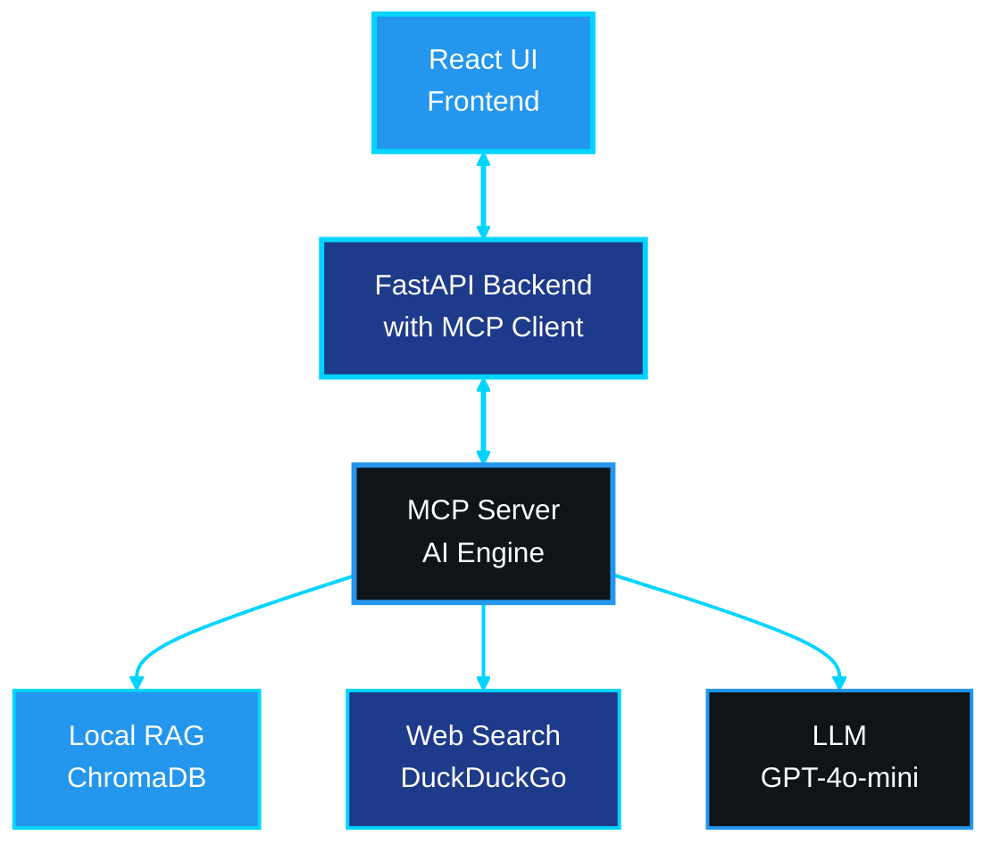

# ContainerShip: AI-Powered Docker Optimization Platform
### Uriel Buitrago, Shane Aung
### Advanced Programming Tools - Summer 2025
---

## Executive Summary

ContainerShip is an innovative web-based platform that leverages Large Language Models (LLMs) and Model Context Protocol (MCP) to provide intelligent Docker container optimization. The project combines real-time web search capabilities with a local knowledge base to deliver cutting-edge containerization recommendations, security analysis, and performance optimization suggestions. Built with a modern tech stack featuring React, FastAPI, and advanced AI integration, ContainerShip represents the next generation of DevOps tooling.

---

## Related Work & Existing Solutions

### Traditional Static Analysis Tools

The Docker ecosystem has historically relied on static analysis tools like Hadolint and Docker Bench for Security that examine Dockerfiles against predefined rulesets. While effective for catching obvious misconfigurations, these tools suffer from limitations in contextual understanding and inability to adapt to evolving best practices without manual updates to the aforementioned rules. They are particularly good at identifying syntactic issues and well-known anti-patterns, but struggle with identifying technology-specific optimization opportunities and emerging security threats that require more than just simple pattern recognition.

### Commercial Security and Optimization Platforms

Enterprise-grade solutions like Snyk, Aqua Security, and Prisma Cloud have advanced the field through vulnerability scanning and runtime security analysis. However, commercial platforms typically focus on security compliance rather than holistic optimization that considers performance, maintainability, and technology-specific best practices. Their proprietary nature limits extensibility and customization, while subscription-based models can present adoption barriers for smaller development teams.

### AI-Powered DevOps Tools

The emergence of AI-powered development assistance has introduced tools like GitHub Copilot, Amazon CodeWhisperer, and various specialized DevOps assistants that leverage LLMs for code generation and optimization suggestions. These tools demonstrate AI-driven development assistance potential but typically operate through general-purpose code completion rather than specialized containerization expertise. Recent developments in AI-powered infrastructure tools like Qovery and Railway automate deployment processes but focus primarily on deployment orchestration rather than container optimization.

Docker Inc. has incorporated AI-powered features into their platform offerings, including intelligent Dockerfile generation capabilities in Docker Desktop and AI-powered vulnerability analysis in Docker Scout. Docker's AI assistant provides conversational interfaces for containerization guidance within Docker Desktop. However, these integrations primarily focus on individual developer productivity within Docker's ecosystem rather than comprehensive optimization analysis and lack the hybrid knowledge architecture that enables continuous learning from both local documentation and current web intelligence.

### ContainerShip's Innovation Position

ContainerShip's unique position emerges from its combination of specialized containerization expertise, hybrid knowledge systems, and extensible AI architecture. Unlike static analysis tools, ContainerShip provides contextual, technology-aware analysis. In contrast to commercial platforms and Docker's proprietary initiatives, ContainerShip offers transparent, extensible architecture with open-source foundations. The platform's hybrid approach combines local documentation with current web intelligence, ensuring both foundational accuracy and temporal relevance while maintaining independence from proprietary platform constraints.

---

## Project Architecture & System Design

### High-Level Architecture

ContainerShip follows a tiered architecture that integrates web technologies with AI-powered analysis.




### Frontend Layer - React TypeScript Application

The user interface is a single-page application built on React with TypeScript, creating an interactive environment for Dockerfile analysis. The frontend displays an uploaded Dockerfile with navigable syntax highlighting and line-by-line recommendations. The interface utilizes intuitive visualization elements to provide warning indicators and clause-based feedback navigation.

Real-time updates stream analysis results with visual progress indicators, keeping users informed throughout the optimization process. The technical foundation leverages Vite for fast development cycles and React Markdown with React Syntax Highlighter for rich content display.

### Backend Layer - FastAPI Server

The backend infrastructure serves as the central orchestration layer, implementing a FastAPI server that bridges user interactions with analysis capabilities. This layer houses the critical MCP (Model Context Protocol) client component that manages all communication with the MCP server, acting as the logical intermediary between user requests and AI-powered analysis tools.

The API handles intelligent file processing by extracting information from a given Dockerfile into dedicated clauses. The integrated MCP client maintains persistent connections to the MCP server, enabling efficient tool invocation and result processing. The API houses the logic to automatically identifying programming languages, frameworks, and deployment patterns from Dockerfile content, which is then passed on to the various AI tools housed in the MCP server for analysis generation.

### AI Engine - MCP Server

The Model Context Protocol server represents the generative engine of the ContainerShip platform, implementing a hybrid knowledge system that combines local Retrieval-Augmented Generation (RAG) capabilities with real-time web search intelligence. This architecture enables the platform to draw from both local documentation repositories and current web-based information, ensuring recommendations remain both foundationally sound and relevant with respect to recent trends.

The server employs a multi-tool architecture where specialized tools address different facets of container optimization, from security analysis to performance enhancement. Built on the FastMCP Python framework, the system maintains extensibility for easy tool addition and modification, allowing the platform to evolve with emerging containerization practices and technologies.

---

## User Experience & Core Functionalities

### Dockerfile Analysis Workflow

The ContainerShip analysis workflow represents a sequence of processing stages designed to parse raw Dockerfiles and turn them into optimized, secure, and performant container definitions. Users enter this workflow by uploading a Dockerfile to the frontend. Upon doing so, users will first receive immediate feedback regarding file format compliance in the form of a view of the file contents with syntax highlighting shown to break down the identified clauses in the file. A carousel view of the pending recommendations for each clause is shown immediately underneath and is waiting for information to be synchronously streamed.

After this, the FastAPI backend's integrated MCP client initiates an analysis pipeline that automatically detects the underlying technology stack (Python Flask applications, Node.js React frontends, Java Spring services, Go microservices, etc). The analysis process employs concurrent processing techniques through coordinated MCP tool invocations to simultaneously evaluate security vulnerabilities, performance optimization opportunities, and adherence to containerization best practices.

The platform's vulnerability analysis workflow represents a security assessment pipeline that automatically extracts Docker image references and package installations from the uploaded Dockerfile. This system performs vulnerability research using open-source security advisories using web searches through both DuckDuckGo (baseline) and Tavily (enhanced) API queries.

The user is finally presented with both the original and optimized Dockerfiles, complemented by dedicated vulnerability assessment panels and clause recommendation cards mapped to highlighted lines. The platform's recommendation engine delivers a Dockerfile that has been augmented with enhancements based on current threat intelligence, performance optimization strategies backed by industry best practices, and multi-stage build recommendations for image size reduction.

---

## Model Context Protocol (MCP) Integration

### MCP Tools Ecosystem

ContainerShip implements a suite of Model Context Protocol tools, each engineered for specific containerization analysis and optimization tasks. This ecosystem represents a balance between specialized functionality and integrated operation, resulting in a general Docker analysis through coordinated tool interactions.

The `docker_docs` tool serves as the foundation of the local knowledge system, leveraging a RAG implementation built upon extensive Docker documentation. This tool employs ChromaDB as its vector database foundation, utilizing OpenAI embeddings for semantic similarity matching. The system implements recursive character text splitting with carefully optimized chunk sizes to ensure optimal information retrieval while maintaining contextual coherence.

The `web_search_docker` tool complements local knowledge with real-time web search, using DuckDuckGo API integration and auxiliary Tavily API for premium search capabilities. The tool performs query optimization specifically designed for Docker-related searches, excelling in security vulnerability research, performance optimization technique discovery, and identification of deprecated functionality warnings alongside emerging best practices.

The `optimize_dockerfile` tool orchestrates multi-layered analysis combining local knowledge repositories with current web research. This tool implements technology-specific optimization strategies and addresses critical optimization dimensions including base image selection strategies, layer reduction techniques, security hardening, and multi-stage build implementation. 

The `search_dockerfile_examples` tool provides access to current, community-validated containerization patterns, while the `check_security_best_practices` tool evaluates Dockerfiles against contemporary security standards through integration with web-based vulnerability databases.

### MCP Architecture Benefits

The Model Context Protocol integration, facilitated through the embedded MCP client within the FastAPI backend, delivers significant architectural advantages that position ContainerShip for long-term scalability and maintainability. The modular design ensures that each MCP tool serves a specific purpose while maintaining seamless interoperability through the centralized MCP client. This client-server architectural approach enables system scalability where new MCP tools can be incorporated on the server side without disrupting existing client functionality.

Maintainability benefits emerge through clear separation of concerns between the MCP client and MCP server, with standardized protocol interfaces that simplify debugging and enhancement processes. The built-in MCP Inspector included in FastMCP provides accessible debugging support, allowing developers to examine client-server communications and tool interactions.

---

## Language Model Integration

### Exploration of Multiple LLMs

ContainerShip features a multi-LLM architecture that allows the developer to set either OpenAI GPT or Google Gemini models as the LLM powering the overall application, providing the flexibility to choose a preferred AI provider based on cost, performance, and availability. 

In our development process, we tested using GPT-4o-mini and Gemini-2.5-Flash. There were noticeable differences in the performance of ContainerShip between the two models. Overall, GPT-4o-mini provided more reasonable and useful clause recommendations and generated optimized Dockerfiles of higher quality compared to Gemini-2.5-Flash; the content generated by Gemini tended to be more superfluous. GPT also generated results faster than Gemini.

### Prompt Engineering

The RAG-enhanced prompting system uses detailed templates that prioritize local documentation context while intelligently integrating current web search results to ensure relevance, thereby approaching context management in a blended manner. Below is an example of one of the templates used in ContainerShip.

```python
RAG_TEMPLATE = """
You are a meticulous Docker expert, use the provided context for reference.   
Your response should be concise, informative, and directly address the question.
You will be replying to other LLM agents.

<context>
{context}
</context>

{web_search_context}

Question: {question}

Instructions:
- Prioritize information from the context above
- If web search results are provided, integrate them with the documentation context
- Focus on practical, actionable advice
- Mention if information might be outdated and suggest checking current sources
"""
```

---

## Future Possibilities

### Scalability & Extensibility

The modular architecture foundation enables seamless integration of additional AI models beyond current OpenAI GPT and Google Gemini support, including Claude, Llama, and other emerging language models. Pluggable search provider architecture extends beyond current DuckDuckGo and Tavily integrations to accommodate additional intelligence sources, while the extensible tool framework supports specialized analysis types for emerging containerization patterns.

Future enhancement opportunities include enhanced search capabilities with additional premium providers beyond Tavily for enterprise-grade intelligence, CI/CD pipeline integration for automated Dockerfile optimization, team collaboration features supporting shared optimization templates, and advanced analytics enabling optimization tracking over time.

### Industry Impact

ContainerShip addresses critical pain points that significantly impact modern software development productivity and operational efficiency. The platform reduces time spent researching Docker best practices through intelligent automation that delivers contextually relevant guidance, while enhancing security posture through proactive vulnerability identification and current threat intelligence integration.

Cost optimization benefits emerge through systematic image size reduction strategies and performance improvements that translate into reduced infrastructure costs. The platform democratizes Docker expertise by making complicated containerization knowledge accessible to developers across different experience levels, reducing the learning curve for containerization adoption while ensuring adherence to best practices. The continuous learning capability ensures that platform recommendations remain current with the rapidly evolving containerization landscape.

---

## Conclusion

ContainerShip represents a step forward in AI-powered development tooling, successfully bridging the gap between traditional documentation-based learning and real-time, intelligent assistance. The platform's combination of local knowledge bases, real-time web intelligence, and advanced LLM integration creates a uniquely powerful system for Docker optimization. Its extensible architecture ensures long-term viability and adaptability to emerging containerization technologies and practices as well as new MCP tools. As containerization continues to dominate modern software deployment strategies, tools like ContainerShip will become increasingly essential for maintaining competitive advantage in software development lifecycle optimization.

---

## Sources

### Technology Stack References

1. **React and Frontend Technologies**
   - [React Documentation](https://react.dev/) - Component architecture and TypeScript integration
   - [Vite Documentation](https://vitejs.dev/) - Build system and development server configuration
   - [React Markdown](https://github.com/remarkjs/react-markdown) and [React Syntax Highlighter](https://github.com/react-syntax-highlighter/react-syntax-highlighter) - Content rendering libraries

2. **FastAPI and Backend Technologies**
   - [FastAPI Documentation](https://fastapi.tiangolo.com/) - RESTful API design and implementation patterns

3. **AI and Machine Learning Integration**
   - [OpenAI API Documentation](https://platform.openai.com/docs/) - Language model integration and prompt engineering
   - [LangChain Documentation](https://python.langchain.com/docs/) - RAG system implementation and vector database integration
   - [ChromaDB Documentation](https://docs.trychroma.com/) - Vector storage and semantic similarity matching

4. **Model Context Protocol (MCP)**
   - [FastMCP Framework](https://github.com/jlowin/fastmcp) - MCP server implementation and tool development
   - [Model Context Protocol Specification](https://spec.modelcontextprotocol.io/) - Client-server communication standards
   - [MCP Inspector](https://github.com/modelcontextprotocol/inspector) - Development and debugging tools

### Industry Analysis Sources

5. **Containerization Tools and Platforms**
   - [Docker Official Documentation](https://docs.docker.com/) - Containerization best practices and features
   - [Hadolint Project](https://github.com/hadolint/hadolint) - Static analysis tool for Dockerfile linting
   - [Docker Bench for Security](https://github.com/docker/docker-bench-security) - Security scanning and compliance checking

6. **Commercial Security Platforms**
   - [Snyk Platform](https://snyk.io/) - Vulnerability scanning and dependency analysis
   - [Aqua Security](https://www.aquasec.com/) - Container security and runtime protection
   - [Prisma Cloud](https://www.paloaltonetworks.com/prisma/cloud) - Enterprise container security solutions

7. **Search and Web Intelligence**
   - [DuckDuckGo Search API](https://duckduckgo.com/api) - Privacy-focused web search integration
   - [Tavily API](https://tavily.com/) - Premium AI-powered search API for enhanced security intelligence
   - [Web Scraping Best Practices](https://scrapfly.io/web-scraping/web-scraping-best-practices/) - Real-time information gathering techniques
   - [Search Engine Optimization Research](https://moz.com/beginners-guide-to-seo) - Search result filtering and relevance scoring

### Academic and Technical References

8. **Retrieval-Augmented Generation (RAG)**
   - [RAG Paper - Lewis et al. 2020](https://arxiv.org/abs/2005.11401) - Retrieval-Augmented Generation for Knowledge-Intensive NLP Tasks
   - [Prompt Engineering Guide](https://www.promptingguide.ai/) - Context-aware prompt engineering techniques

9. **DevOps and Container Optimization**
    - [Container Security Guide](https://www.nist.gov/publications/application-container-security-guide) - NIST container security best practices
    - [Docker Multi-stage Builds](https://docs.docker.com/develop/dev-best-practices/) - Multi-stage builds and image optimization
    - [Container Performance Optimization](https://kubernetes.io/docs/concepts/cluster-administration/system-logs/) - Performance strategies for containerized applications
