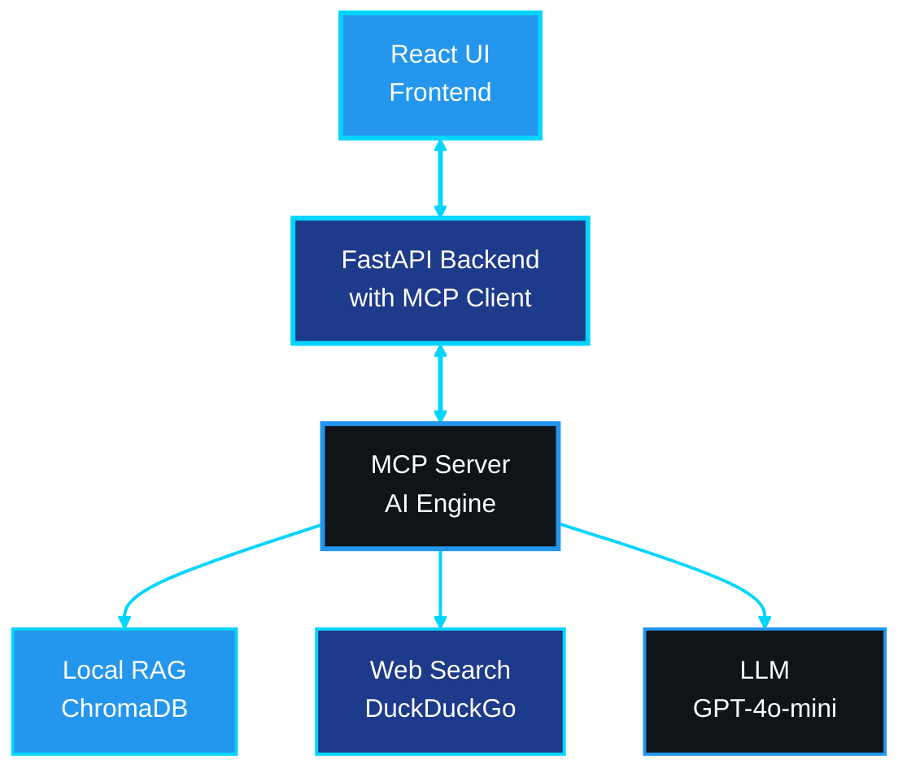

# ContainerShip: AI-Powered Docker Optimization Platform
## Comprehensive Project Report
### Uriel Buitrago, Shane Aung
### Advanced Programming Tools - Summer 2025
---

## Executive Summary

ContainerShip is an innovative web-based platform that leverages Large Language Models (LLMs) and Model Context Protocol (MCP) to provide intelligent Docker container optimization. The project combines real-time web search capabilities with a comprehensive local knowledge base to deliver cutting-edge containerization recommendations, security analysis, and performance optimization suggestions. Built with a modern tech stack featuring React, FastAPI, and advanced AI integration, ContainerShip represents the next generation of DevOps tooling.

---

## Related Work & Existing Solutions

The containerization optimization landscape encompasses various approaches ranging from static analysis tools to cloud-native security platforms. Understanding the existing ecosystem provides crucial context for ContainerShip's innovative contributions to this rapidly evolving field.

### Traditional Static Analysis Tools

The Docker ecosystem has historically relied on static analysis tools like Hadolint and Docker Bench for Security that examine Dockerfiles against predefined rulesets. While effective for catching obvious misconfigurations, these tools suffer from limitations in contextual understanding and inability to adapt to evolving best practices without manual rule updates. They excel in identifying syntactic issues and well-known anti-patterns but struggle with technology-specific optimization opportunities and emerging security threats that require contextual analysis beyond simple pattern recognition.

### Commercial Security and Optimization Platforms

Enterprise-grade solutions like Snyk, Aqua Security, and Prisma Cloud have advanced the field through comprehensive vulnerability scanning and runtime security analysis. However, commercial platforms typically focus on security compliance rather than holistic optimization that considers performance, maintainability, and technology-specific best practices. Their proprietary nature limits extensibility and customization, while subscription-based models can present adoption barriers for smaller development teams.

### AI-Powered DevOps Tools

The emergence of AI-powered development assistance has introduced tools like GitHub Copilot, Amazon CodeWhisperer, and various specialized DevOps assistants that leverage large language models for code generation and optimization suggestions. These tools demonstrate AI-driven development assistance potential but typically operate through general-purpose code completion rather than specialized containerization expertise. Recent developments in AI-powered infrastructure tools like Qovery and Railway automate deployment processes but focus primarily on deployment orchestration rather than container optimization.

### Docker's AI Initiatives

Docker Inc. has incorporated AI-powered features into their platform offerings, including intelligent Dockerfile generation capabilities in Docker Desktop and AI-powered vulnerability analysis in Docker Scout. Docker's AI assistant provides conversational interfaces for containerization guidance within Docker Desktop. However, these integrations primarily focus on individual developer productivity within Docker's ecosystem rather than comprehensive optimization analysis and lack the hybrid knowledge architecture that enables continuous learning from both local documentation and current web intelligence.

### Limitations of Current Approaches

Existing containerization optimization solutions exhibit critical limitations that ContainerShip addresses. Static analysis tools lack contextual awareness of technology stacks and current security landscapes, leading to generic recommendations. Commercial platforms operate as black boxes with limited transparency and vendor lock-in concerns. General-purpose AI tools lack specialized containerization knowledge and cannot access current vulnerability databases or integrate multiple information sources. Docker's AI initiatives, while innovative, remain focused on proprietary ecosystem integration rather than extensible, community-driven development.

### ContainerShip's Innovation Position

ContainerShip's unique position emerges from its combination of specialized containerization expertise, hybrid knowledge systems, and extensible AI architecture. Unlike static analysis tools, ContainerShip provides contextual, technology-aware analysis. In contrast to commercial platforms and Docker's proprietary initiatives, ContainerShip offers transparent, extensible architecture with open-source foundations. The platform's hybrid approach combines comprehensive local documentation with current web intelligence, ensuring both foundational accuracy and temporal relevance while maintaining independence from proprietary platform constraints.

---

## Project Architecture & System Design

### High-Level Architecture

ContainerShip follows a sophisticated three-tier architecture that seamlessly integrates web technologies with AI-powered analysis:




### Component Deep Dive

#### Frontend Layer - React TypeScript Application

The user interface represents a sophisticated single-page application built on React with TypeScript, creating an interactive environment for Docker optimization. The frontend features an advanced Dockerfile editor with real-time syntax highlighting and line-by-line analysis capabilities. The interface employs responsive design principles while dynamic visualization elements provide color-coded warning indicators and intuitive clause-based navigation.

The application architecture emphasizes modularity through reusable components such as `ClauseCard` and `DockerfileDisplay`. Real-time updates stream analysis results with comprehensive progress indicators, keeping users informed throughout the optimization process. The technical foundation leverages Vite for fast development cycles, Axios for API communication, and React Markdown with React Syntax Highlighter for rich content display.

#### Backend Layer - FastAPI Server

The backend infrastructure serves as the central orchestration layer, implementing a robust FastAPI server that bridges user interactions with AI-powered analysis capabilities. This layer houses the critical MCP (Model Context Protocol) client component that manages all communication with the MCP server, acting as the intelligent intermediary between user requests and AI-powered analysis tools.

The server excels in intelligent file processing, implementing advanced Dockerfile parsing algorithms and clause extraction mechanisms. The integrated MCP client maintains persistent connections to the MCP server, enabling efficient tool invocation and result processing. The backend's core strength lies in its technology detection capabilities, automatically identifying programming languages, frameworks, and deployment patterns from Dockerfile content. The MCP client translates these detection results into appropriate tool invocations, coordinating between multiple AI tools to deliver comprehensive analysis results.

#### AI Engine - MCP Server

The Model Context Protocol server represents the intellectual core of the ContainerShip platform, implementing a sophisticated hybrid knowledge system that combines local Retrieval-Augmented Generation capabilities with real-time web search intelligence. This architecture enables the platform to draw from both comprehensive local documentation repositories and current web-based information, ensuring recommendations remain both foundationally sound and temporally relevant.

The server employs a multi-tool architecture where specialized tools address different facets of container optimization, from security analysis to performance enhancement. Built on the FastMCP framework, the system maintains extensibility for easy tool addition and modification, allowing the platform to evolve with emerging containerization practices and technologies.

---

## User Experience & Core Functionalities

### Dockerfile Analysis Workflow

The ContainerShip analysis workflow represents a carefully orchestrated sequence of intelligent processing stages designed to transform raw Dockerfiles into optimized, secure, and performant container definitions. The process begins with an intuitive file upload interface employing drag-and-drop functionality with comprehensive validation mechanisms. Users receive immediate feedback regarding file format compliance while real-time content preview with syntax highlighting provides instant visual confirmation.

Upon successful upload, the FastAPI backend's integrated MCP client initiates an intelligent analysis pipeline that automatically detects the underlying technology stack, whether Python Flask applications, Node.js React frontends, Java Spring services, or Go microservices. The analysis process employs concurrent processing techniques through coordinated MCP tool invocations to simultaneously evaluate security vulnerabilities, performance optimization opportunities, and adherence to containerization best practices.

Results presentation follows a sophisticated interactive model featuring side-by-side comparisons of original and optimized Dockerfiles. Color-coded line highlighting immediately draws attention to problematic areas, while navigable recommendation cards provide detailed explanations accessible through intuitive user interface controls. The platform's comprehensive recommendation engine delivers security vulnerability assessments enhanced with current threat intelligence, performance optimization strategies based on industry best practices, and multi-stage build recommendations for image size reduction.

### Advanced Features

ContainerShip's advanced feature set distinguishes it from conventional static analysis tools through its integration of real-time web intelligence with local knowledge repositories. The platform maintains awareness of current Docker best practices and security updates through continuous web monitoring, ensuring recommendations reflect the rapidly evolving containerization ecosystem rather than static documentation snapshots.

Technology-aware analysis represents another significant advancement, where the system tailors recommendations based on detected programming languages, frameworks, and deployment patterns. The platform implements progressive enhancement principles where analysis quality continuously improves through additional context gathering from web search results, ensuring comprehensive coverage through multiple information sources.

---

## Model Context Protocol (MCP) Integration

### MCP Tools Ecosystem

ContainerShip implements a sophisticated suite of Model Context Protocol tools, each engineered for specific containerization analysis and optimization tasks. This ecosystem represents a careful balance between specialized functionality and integrated operation, enabling comprehensive Docker analysis through coordinated tool interactions.

The `docker_docs` tool serves as the foundation of the local knowledge system, leveraging a comprehensive RAG implementation built upon extensive Docker documentation. This tool employs ChromaDB as its vector database foundation, utilizing OpenAI embeddings for semantic similarity matching. The system implements recursive character text splitting with carefully optimized chunk sizes to ensure optimal information retrieval while maintaining contextual coherence.

The `web_search_docker` tool complements local knowledge with real-time web intelligence, implementing sophisticated search strategies through DuckDuckGo integration. This tool performs intelligent query optimization specifically designed for Docker-related searches, excelling in security vulnerability research, performance optimization technique discovery, and identification of deprecated functionality warnings alongside emerging best practices.

The `optimize_dockerfile` tool orchestrates multi-layered analysis combining local knowledge repositories with current web research. This tool implements technology-specific optimization strategies and addresses critical optimization dimensions including base image selection strategies, layer reduction techniques, security hardening, and multi-stage build implementation. The `search_dockerfile_examples` tool provides access to current, community-validated containerization patterns, while the `check_security_best_practices` tool evaluates Dockerfiles against contemporary security standards through integration with web-based vulnerability databases.

### MCP Architecture Benefits

The Model Context Protocol integration, facilitated through the embedded MCP client within the FastAPI backend, delivers significant architectural advantages that position ContainerShip for long-term scalability and maintainability. The modular design ensures that each MCP tool serves a specific purpose while maintaining seamless interoperability through the centralized MCP client. This client-server architectural approach enables system scalability where new MCP tools can be incorporated on the server side without disrupting existing client functionality.

Maintainability benefits emerge through clear separation of concerns between the MCP client and MCP server, with standardized protocol interfaces that simplify debugging and enhancement processes. The built-in MCP Inspector provides comprehensive debugging support, allowing developers to examine client-server communications and tool interactions. This combination of modularity, scalability, maintainability, and debugging capability creates a robust foundation for sophisticated containerization analysis.

---

## LLM-Based Features & AI Capabilities

### Advanced Language Model Integration

#### GPT-4o-mini Integration Architecture

ContainerShip leverages OpenAI's GPT-4o-mini through multiple carefully designed integration points that maximize the model's analytical capabilities while maintaining cost-effectiveness and response speed. The integration architecture centers on five primary functions: contextual analysis for deep understanding of Dockerfile intent and purpose, sophisticated recommendation generation tailored to specific use cases, security assessment that evaluates vulnerabilities within current threat contexts, code generation for optimized Dockerfile versions, and explanation synthesis that transforms complex technical analysis into user-friendly recommendations.

#### Sophisticated Prompt Engineering

The platform's prompt engineering strategy represents a sophisticated approach to context management that seamlessly blends multiple information sources into coherent, actionable guidance. The RAG-enhanced prompting system employs carefully crafted templates that prioritize local documentation context while intelligently integrating current web search results to ensure temporal relevance.

```python
RAG_TEMPLATE = """
You are a meticulous Docker expert, use the provided context for reference.   
Your response should be concise, informative, and directly address the question.
You will be replying to other LLM agents.

<context>
{context}
</context>

{web_search_context}

Question: {question}

Instructions:
- Prioritize information from the context above
- If web search results are provided, integrate them with the documentation context
- Focus on practical, actionable advice
- Mention if information might be outdated and suggest checking current sources
"""
```

The multi-context integration approach represents a breakthrough in information synthesis, where the system harmoniously combines local documentation repositories with real-time web search results. Technology-specific knowledge integration ensures that recommendations consider the unique requirements and constraints of different development frameworks, while security intelligence integration weaves vulnerability assessment data throughout the analysis process.

#### Intelligent Technology Detection

The platform implements sophisticated technology detection algorithms that analyze Dockerfile content to automatically identify underlying technology stacks and deployment patterns. This automated recognition capability extends far beyond simple keyword matching to understand the contextual relationships between base images, package managers, framework dependencies, and deployment configurations.

The detection system excels in primary language identification across diverse ecosystems including Python, Node.js, Java, Go, Rust, PHP, and Ruby, while simultaneously recognizing framework-specific patterns such as Flask, Django, FastAPI for Python, or React, Express for Node.js environments. This technology awareness enables the generation of highly targeted recommendations that consider the specific requirements, performance characteristics, and security considerations associated with each development framework.

#### Advanced Analysis Pipeline

The ContainerShip analysis pipeline represents a sophisticated multi-stage processing system designed to maximize analysis quality while maintaining responsive user experience. The pipeline begins with comprehensive preprocessing that normalizes content structure and performs initial analysis to establish processing parameters. Context gathering represents a critical stage where parallel execution of RAG queries and web searches provides comprehensive information foundation for analysis.

The LLM analysis stage processes this enriched context through GPT-4o-mini, leveraging advanced prompt engineering to generate targeted recommendations. Post-processing stages focus on formatting optimization and recommendation enhancement, ensuring that AI-generated insights translate into actionable implementation guidance. The pipeline's streaming analysis capabilities provide real-time progress updates during extended processing operations, maintaining user engagement through incremental result delivery.

---

## Technical Innovation & Future Potential

### Cutting-Edge Features

ContainerShip's hybrid AI architecture represents a pioneering approach to AI-powered DevOps tooling that successfully combines the reliability of local knowledge bases with the currency of real-time web intelligence. This architecture delivers consistent, foundational information through comprehensive local documentation while simultaneously providing access to current best practices and emerging security considerations through dynamic web search capabilities.

The platform's web-enhanced RAG system sets new standards for information retrieval in technical domains through dynamic context switching between local and web sources based on query characteristics and temporal relevance. Intelligent source prioritization algorithms determine the most appropriate information sources for specific query types, while multi-source synthesis capabilities enable comprehensive recommendations that draw from multiple information streams.

### Scalability & Extensibility

The modular architecture foundation enables seamless integration of additional AI models beyond GPT-4o-mini, including Claude, Llama, and other emerging language models. Pluggable search provider architecture extends beyond current DuckDuckGo integration to accommodate additional intelligence sources, while the extensible tool framework supports specialized analysis types for emerging containerization patterns.

Future enhancement opportunities include enhanced search capabilities with additional providers such as Tavily API for premium search results, comprehensive CI/CD pipeline integration for automated Dockerfile optimization, team collaboration features supporting shared optimization templates, advanced analytics enabling optimization tracking over time, and integration with container orchestration platforms including Kubernetes and Docker Swarm.

### Industry Impact

ContainerShip addresses critical pain points that significantly impact modern software development productivity and operational efficiency. The platform reduces time spent researching Docker best practices through intelligent automation that delivers contextually relevant guidance, while enhancing security posture through proactive vulnerability identification and current threat intelligence integration.

Cost optimization benefits emerge through systematic image size reduction strategies and performance improvements that translate into reduced infrastructure costs. The platform democratizes Docker expertise by making sophisticated containerization knowledge accessible to developers across different experience levels, reducing the learning curve for containerization adoption while ensuring adherence to best practices. The continuous learning capability ensures that platform recommendations remain current with the rapidly evolving containerization landscape.

---

## Conclusion

ContainerShip represents a significant advancement in AI-powered development tooling, successfully bridging the gap between traditional documentation-based learning and real-time, intelligent assistance. The project's sophisticated architecture, comprehensive feature set, and innovative use of cutting-edge AI technologies position it as a transformative tool for modern software development teams.

The platform's combination of local knowledge bases, real-time web intelligence, and advanced LLM integration creates a uniquely powerful system for Docker optimization. Its extensible architecture ensures long-term viability and adaptability to emerging containerization technologies and practices.

As containerization continues to dominate modern software deployment strategies, tools like ContainerShip will become increasingly essential for maintaining competitive advantage in software development lifecycle optimization. The project stands as a testament to the potential of AI-augmented development tools and sets a new standard for intelligent DevOps assistance.

Through its comprehensive approach to Docker optimization, user-centric design, and technical innovation, ContainerShip not only solves current containerization challenges but also provides a foundation for future advancements in AI-powered software development tooling.

---

## Sources

### Technology Stack References

1. **React and Frontend Technologies**
   - [React Documentation](https://react.dev/) - Component architecture and TypeScript integration
   - [Vite Documentation](https://vitejs.dev/) - Build system and development server configuration
   - [React Markdown](https://github.com/remarkjs/react-markdown) and [React Syntax Highlighter](https://github.com/react-syntax-highlighter/react-syntax-highlighter) - Content rendering libraries

2. **FastAPI and Backend Technologies**
   - [FastAPI Documentation](https://fastapi.tiangolo.com/) - RESTful API design and implementation patterns
   - [Python async/await Documentation](https://docs.python.org/3/library/asyncio.html) - Asynchronous processing implementation
   - [FastAPI CORS Documentation](https://fastapi.tiangolo.com/tutorial/cors/) - Cross-origin resource sharing setup

3. **AI and Machine Learning Integration**
   - [OpenAI API Documentation](https://platform.openai.com/docs/) - Language model integration and prompt engineering
   - [LangChain Documentation](https://python.langchain.com/docs/) - RAG system implementation and vector database integration
   - [ChromaDB Documentation](https://docs.trychroma.com/) - Vector storage and semantic similarity matching

4. **Model Context Protocol (MCP)**
   - [FastMCP Framework](https://github.com/jlowin/fastmcp) - MCP server implementation and tool development
   - [Model Context Protocol Specification](https://spec.modelcontextprotocol.io/) - Client-server communication standards
   - [MCP Inspector](https://github.com/modelcontextprotocol/inspector) - Development and debugging tools

### Industry Analysis Sources

5. **Containerization Tools and Platforms**
   - [Docker Official Documentation](https://docs.docker.com/) - Containerization best practices and features
   - [Hadolint Project](https://github.com/hadolint/hadolint) - Static analysis tool for Dockerfile linting
   - [Docker Bench for Security](https://github.com/docker/docker-bench-security) - Security scanning and compliance checking

6. **Commercial Security Platforms**
   - [Snyk Platform](https://snyk.io/) - Vulnerability scanning and dependency analysis
   - [Aqua Security](https://www.aquasec.com/) - Container security and runtime protection
   - [Prisma Cloud](https://www.paloaltonetworks.com/prisma/cloud) - Enterprise container security solutions

7. **Search and Web Intelligence**
   - [DuckDuckGo Search API](https://duckduckgo.com/api) - Privacy-focused web search integration
   - [Web Scraping Best Practices](https://scrapfly.io/web-scraping/web-scraping-best-practices/) - Real-time information gathering techniques
   - [Search Engine Optimization Research](https://moz.com/beginners-guide-to-seo) - Search result filtering and relevance scoring

### Academic and Technical References

8. **Retrieval-Augmented Generation (RAG)**
   - [RAG Paper - Lewis et al. 2020](https://arxiv.org/abs/2005.11401) - Retrieval-Augmented Generation for Knowledge-Intensive NLP Tasks
   - [Vector Database Design](https://weaviate.io/blog/what-is-a-vector-database) - Vector database architecture and implementation
   - [Prompt Engineering Guide](https://www.promptingguide.ai/) - Context-aware prompt engineering techniques

9. **DevOps and Container Optimization**
    - [Container Security Guide](https://www.nist.gov/publications/application-container-security-guide) - NIST container security best practices
    - [Docker Multi-stage Builds](https://docs.docker.com/develop/dev-best-practices/) - Multi-stage builds and image optimization
    - [Container Performance Optimization](https://kubernetes.io/docs/concepts/cluster-administration/system-logs/) - Performance strategies for containerized applications

This comprehensive analysis was conducted through direct examination of the ContainerShip codebase, supplemented by industry knowledge of containerization tools, AI-powered development platforms, and software architecture best practices referenced above.
