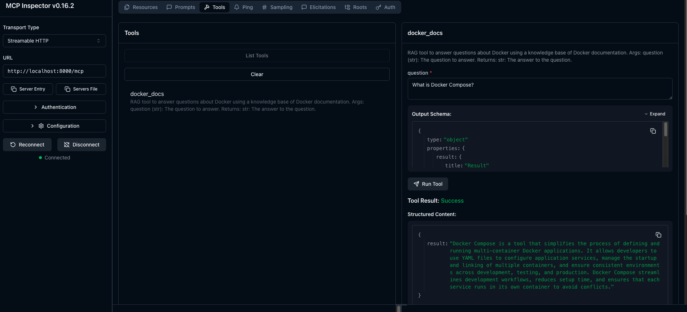

# ContainerShip
Web-App Container optimizer via LLMs

# Development

## MCP Server
First, ensure that you have a virtual environment active with the needed packages. Below are the steps followed to achieve that.

TODO: Use uv since that is reccomended by the FastMCP project docs
```bash
$ python3 -m venv venv
$ source venv/bin/activate
(venv)$ pip install -r requirements.txt
```

Open a terminal and navigate to `model/mcp-server/`. Within that directory, start the MCP server locally:
```bash
python server.py
```

You should see confirmation from the Uvicorn server that process started. 

Next, open a new terminal window (with the virtual environment active) and start the MCP Inspector:
```bash
fastmcp dev server.py
```

You may get a request to download an nodejs package, say yes (this is likely the inspector). Eventually, your browser should open a new tab for MCP Inspector. 

Ensure the settings of the server are correct by referring to the values in the settings. They should be set to the following:
* `Transport Type` -> `Streamable HTTP`
* `URL` -> `http://localhost:8000/mcp`

Now, you should be ready to connect to the running server and test it. 

Click the "connect" button on the bottom left. After successfully connecting, you should be able to view the RAG Tool under the __Tools__ tab.

The screenshot below is what you should see from MCP Inspector when testing the __docker_docs__ Tool. 


