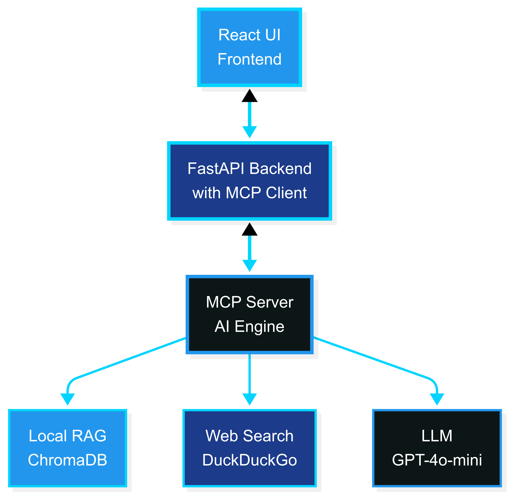

<!-- _class: lead -->
<!-- _paginate: false -->
<!-- _header: "" -->
<!-- _footer: "" -->

# ContainerShip
## AI-Powered Docker Optimization Platform

**Uriel Buitrago & Shane Aung**
Advanced Programming Tools - Summer 2025

---

### The Problem with Current Docker Optimization

• **Static analysis tools** lack contextual understanding
• **Commercial platforms** operate as "black boxes" with vendor lock-in  
• **Generic AI tools** don't understand containerization specifics
• **Developers struggle** with evolving best practices
• **Security vulnerabilities** often go undetected until runtime

<!-- 
Speaker Notes: Let's start by understanding the problem we're solving. Currently, Docker optimization relies heavily on static analysis tools like Hadolint that work with predefined rules. While these catch obvious mistakes, they lack contextual understanding of your specific technology stack. Commercial platforms like Snyk offer more features but operate as black boxes with expensive subscriptions and vendor lock-in. Even modern AI tools like GitHub Copilot, while powerful for general code completion, don't have the specialized containerization knowledge needed for effective Docker optimization. This leaves developers manually researching best practices and security updates, which is time-consuming and error-prone.
-->

---

### ContainerShip Solution Overview

• **Multi-LLM AI optimization** with OpenAI GPT & Google Gemini support
• **Enhanced hybrid knowledge**: Local docs + DuckDuckGo + Tavily intelligence  
• **Integrated vulnerability scanning** for Docker images and packages
• **Technology-aware analysis** tailored to your specific stack
• **Interactive web interface** with real-time analysis & security assessment
• **Extensible MCP architecture** for continuous improvement

<!-- 
Speaker Notes: ContainerShip addresses these limitations through a comprehensive AI-powered approach. We support multiple LLM providers - both OpenAI GPT and Google Gemini models - allowing optimization for cost, performance, or availability. Our enhanced hybrid architecture combines local documentation with real-time web intelligence through DuckDuckGo and Tavily APIs. The platform provides technology-aware analysis with integrated vulnerability scanning for Docker images and packages. All delivered through an intuitive interface with real-time analysis and security assessment.
-->

---

### System Architecture

<!-- 
Speaker Notes: Our tiered architecture integrates web technologies with AI-powered analysis. The React TypeScript frontend features advanced Dockerfile editing with syntax highlighting and vulnerability scanning interface. The FastAPI backend houses our MCP client managing multi-LLM communication. The AI engine coordinates specialized tools for Docker optimization. Our knowledge system draws from ChromaDB for local documentation, DuckDuckGo for privacy-focused search, and Tavily for premium security intelligence - all processed through GPT or Gemini models optimized for containerization analysis.
-->

---

### Architecture Components

#### **Frontend**: React TypeScript UI
• Real-time Dockerfile editor • Interactive analysis visualization • **Integrated vulnerability scanner**

#### **Backend**: FastAPI Server  
• **Multi-LLM support** (GPT + Gemini) • MCP client for AI communication • Technology detection pipeline • Clause parsing 

#### **AI Engine**: MCP Server
• Multi-tool architecture for specialized optimization • **Enhanced web search** with Tavily • Hybrid knowledge coordination

#### **Knowledge Sources**
• **ChromaDB**: Local Docker documentation (RAG) • **DuckDuckGo**: Privacy-focused web intelligence • **Tavily API**: Premium security & threat intelligence

<!-- 
Speaker Notes: The frontend creates an interactive environment for Dockerfile analysis with navigable syntax highlighting and clause-based feedback. The backend serves as orchestration layer with the MCP client managing all AI communication and technology detection. The AI engine employs multi-tool architecture where specialized tools address different optimization facets. The knowledge system ensures recommendations remain both foundationally sound and current through multiple intelligence sources.
-->

---

### Model Context Protocol (MCP) Integration - Core Tools

#### **docker_docs**
RAG system with comprehensive Docker documentation & ChromaDB

#### **web_search_docker** 
**Multi-provider** intelligence: DuckDuckGo + Tavily APIs

#### **optimize_dockerfile**
Multi-layered analysis with technology-specific strategies

<!-- 
Speaker Notes: Let me walk you through our specialized MCP tools. The docker_docs tool serves as our knowledge foundation, implementing a sophisticated RAG system built on extensive Docker documentation with ChromaDB and OpenAI embeddings. The web_search_docker tool features multi-provider capabilities, combining DuckDuckGo's privacy-focused search with Tavily's premium security intelligence. The optimize_dockerfile tool orchestrates comprehensive analysis with technology-specific strategies, addressing critical optimization dimensions including base image selection, layer reduction, security hardening, and multi-stage builds.
-->

---

### Model Context Protocol (MCP) Integration - Security Tools

#### **check_security_best_practices**
**Enhanced vulnerability assessment** with web-based threat intelligence

#### **search_dockerfile_examples**
Community-validated containerization patterns

#### **search_security_vulnerabilities** 
**Dedicated CVE & image vulnerability scanning**

<!-- 
Speaker Notes: Our security-focused MCP tools complete the ecosystem. The check_security_best_practices tool evaluates Dockerfiles against contemporary security standards through integration with web-based vulnerability databases. The search_dockerfile_examples tool provides access to current, community-validated containerization patterns. Our latest addition, search_security_vulnerabilities, provides dedicated CVE scanning and image vulnerability assessment using current threat intelligence. This modular approach enables easy capability expansion without disrupting existing functionality.
-->

---

### User Experience & Dockerfile Analysis Workflow

#### **Validaton & Technology Detection** 
Automatic stack identification (Python Flask, Node.js, Java Spring, Go)

#### **Vulnerability Analysis** 
**Automated security assessment** of images and packages

#### **Interactive Results**
Side-by-side comparison with **vulnerability panels** & recommendation cards

#### **Real-time Streaming**
Synchronous updates with visual progress indicators

<!-- 
Speaker Notes: The workflow represents carefully orchestrated processing stages. Users upload Dockerfiles and receive immediate feedback with syntax highlighting breaking down identified clauses. The backend's MCP client initiates analysis detecting the technology stack automatically. The vulnerability workflow extracts Docker images and packages for security assessment using multi-source intelligence. Users see original and optimized Dockerfiles with vulnerability assessment panels and clause recommendation cards mapped to highlighted lines.
-->

---

### Language Model Integration & AI Capabilities

#### **Exploration of Different LLMs** 
Flexible OpenAI GPT & Google Gemini model selection
GPT-4o-mini: Higher quality recommendations & faster results
Gemini-2.5-Flash: Cost-effective with some verbosity trade-offs

#### **Enhanced Prompt Engineering**
RAG-enhanced templates prioritizing local docs + web integration

#### **Context Management**
Seamless blending of local + **multi-source** web intelligence

#### **Technology Awareness**
Framework-specific optimization strategies

<!-- 
Speaker Notes: Our multi-LLM architecture allows developers to choose between OpenAI GPT and Google Gemini based on cost, performance, and availability. In development, we found GPT-4o-mini provided higher quality clause recommendations and faster results, while Gemini offered cost benefits with some verbosity. Our RAG-enhanced prompting system uses detailed templates prioritizing local documentation while integrating web search results. The system implements progressive enhancement where analysis quality improves through multiple provider contexts.
-->

---

# Live Product Demo

<!-- 
Speaker Notes: [For live demo] Let me demonstrate ContainerShip analyzing a typical suboptimal Python Flask Dockerfile. Watch as the system immediately detects the technology stack and begins tailored analysis with integrated vulnerability scanning. You'll see comprehensive results including CVE scanning of base images and packages, security vulnerabilities, and performance issues. The before-and-after comparison shows traditional improvements plus security insights from our vulnerability scanner. Users can explore detailed vulnerability reports alongside optimization recommendations.
-->

---

### Industry Impact & Results

#### **Developer Productivity Enhancement**
Intelligent automation delivering contextually relevant guidance

#### **Security Posture Improvement** 
**Proactive vulnerability identification** with integrated CVE scanning

#### **Cost Optimization Benefits**
Systematic image size reduction & performance improvements

#### **Knowledge Accessibility**
Making **containerization & security expertise** accessible

#### **Continuous Learning Capability**
Platform recommendations remain current with ecosystem evolution

<!-- 
Speaker Notes: ContainerShip addresses critical pain points significantly impacting software development productivity and operational efficiency. Developer productivity increases by reducing time spent researching Docker best practices through intelligent automation. Security posture improves through proactive vulnerability identification with current threat intelligence integration. Cost optimization emerges through systematic strategies translating to reduced infrastructure costs. We democratize Docker expertise, making sophisticated containerization knowledge accessible across experience levels while ensuring adherence to best practices.
-->

---

### Future Possibilities & Roadmap

#### **Extended Multi-LLM Ecosystem**
Integration with **Claude, Llama**, and emerging models

#### **CI/CD Pipeline Integration** 
Automated optimization **& vulnerability scanning** in development workflows

#### **Team Collaboration Features**
Shared optimization templates **& security policies** for enterprises

<!-- 
Speaker Notes: Our roadmap includes exciting enhancements strengthening ContainerShip's position as the leading containerization optimization platform. The modular architecture foundation enables seamless integration of additional AI models beyond current OpenAI and Gemini support. Pluggable search provider architecture will extend beyond current integrations. Future opportunities include comprehensive CI/CD integration, team collaboration features, and advanced analytics. The extensible tool framework supports specialized analysis types for emerging containerization patterns.
-->

---

<!-- _class: lead -->

### Conclusion

#### **Proven Architecture** 
Scalable, extensible, and maintainable

#### **Real Impact**
Measurable improvements in security, performance, and productivity

---

<!-- _class: lead -->

# Questions & Discussion

Thank you for your attention!

<!-- 
Speaker Notes: In conclusion, ContainerShip represents a revolutionary approach to containerization optimization that successfully bridges traditional documentation-based learning with intelligent, real-time assistance. Our proven architecture demonstrates that specialized AI applications can deliver significant value beyond generic code completion tools. We've shown real impact across security, performance, and developer productivity metrics. Most importantly, our open innovation approach ensures this technology will continue evolving with community input and emerging best practices. I'd be happy to take any questions about ContainerShip's architecture, implementation, or future direction. Thank you for your attention.
-->
